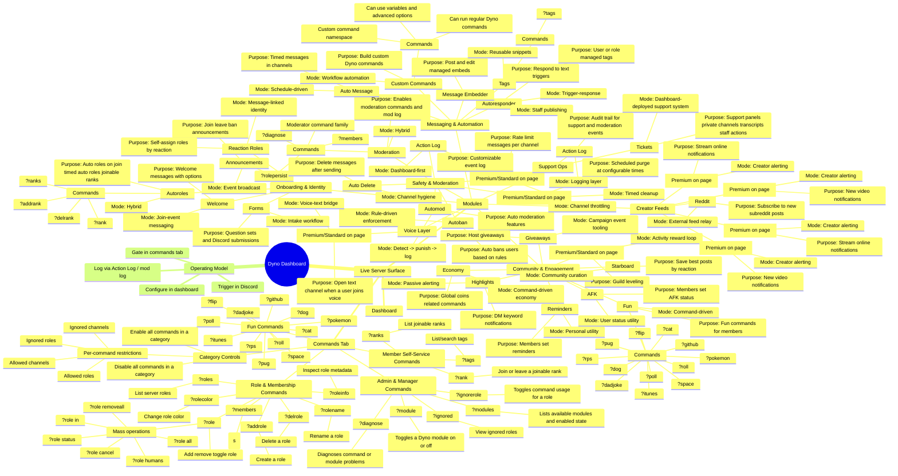

# Dyno Mermaid Tree

This Mermaid tree maps the live Dyno dashboard modules visible on the current server page and overlays the command system documented by Dyno.

```mermaid
mindmap
  root((Dyno Dashboard))
    Live Server Surface
      Dashboard
      Modules
        Safety & Moderation
          Action Log
            Purpose: Customizable event log
            Mode: Dashboard-first
          Automod
            Purpose: Auto moderation features
            Mode: Detect -> punish -> log
          Moderation
            Purpose: Enables moderation commands and mod log
            Mode: Hybrid
            Commands
              ?diagnose
              Moderator command family
              ?rolepersist
              ?members
          Autoban
            Purpose: Auto bans users based on rules
            Mode: Rule-driven enforcement
          Slowmode [Premium/Standard on page]
            Purpose: Rate limit messages per channel
            Mode: Channel throttling
          Auto Delete
            Purpose: Delete messages after sending
            Mode: Channel hygiene
          Auto Purge [Premium/Standard on page]
            Purpose: Scheduled purge at configurable times
            Mode: Timed cleanup
        Onboarding & Identity
          Welcome
            Purpose: Welcome messages with options
            Mode: Join-event messaging
          Announcements
            Purpose: Join leave ban announcements
            Mode: Event broadcast
          Autoroles
            Purpose: Auto roles on join timed auto roles joinable ranks
            Mode: Hybrid
            Commands
              ?rank
              ?ranks
              ?addrank
              ?delrank
          Reaction Roles
            Purpose: Self-assign roles by reaction
            Mode: Message-linked identity
          Forms
            Purpose: Question sets and Discord submissions
            Mode: Intake workflow
        Messaging & Automation
          Auto Message
            Purpose: Timed messages in channels
            Mode: Schedule-driven
          Autoresponder
            Purpose: Respond to text triggers
            Mode: Trigger-response
          Message Embedder
            Purpose: Post and edit managed embeds
            Mode: Staff publishing
          Custom Commands
            Purpose: Build custom Dyno commands
            Mode: Workflow automation
            Commands
              Custom command namespace
              Can run regular Dyno commands
              Can use variables and advanced options
          Tags
            Purpose: User or role managed tags
            Mode: Reusable snippets
            Commands
              ?tags
        Community & Engagement
          Levels [Premium/Standard on page]
            Purpose: Guild leveling
            Mode: Activity reward loop
          Giveaways
            Purpose: Host giveaways
            Mode: Campaign event tooling
          Starboard
            Purpose: Save best posts by reaction
            Mode: Community curation
          AFK
            Purpose: Members set AFK status
            Mode: User status utility
          Reminders
            Purpose: Members set reminders
            Mode: Personal utility
          Highlights
            Purpose: DM keyword notifications
            Mode: Passive alerting
          Fun
            Purpose: Fun commands for members
            Mode: Command-driven
            Commands
              ?cat
              ?dadjoke
              ?dog
              ?flip
              ?github
              ?itunes
              ?pokemon
              ?poll
              ?pug
              ?roll
              ?rps
              ?space
          Economy
            Purpose: Global coins related commands
            Mode: Command-driven economy
        Support Ops
          Tickets
            Purpose: Support panels private channels transcripts staff actions
            Mode: Dashboard-deployed support system
          Action Log
            Purpose: Audit trail for support and moderation events
            Mode: Logging layer
        Creator Feeds
          Reddit
            Purpose: Subscribe to new subreddit posts
            Mode: External feed relay
          Twitch [Premium on page]
            Purpose: Stream online notifications
            Mode: Creator alerting
          Youtube [Premium on page]
            Purpose: New video notifications
            Mode: Creator alerting
          TikTok [Premium on page]
            Purpose: New video notifications
            Mode: Creator alerting
          Kick [Premium on page]
            Purpose: Stream online notifications
            Mode: Creator alerting
        Voice Layer
          Voice Text Linking [Premium/Standard on page]
            Purpose: Open text channel when a user joins voice
            Mode: Voice-text bridge
      Commands Tab
        Category Controls
          Enable all commands in a category
          Disable all commands in a category
          Per-command restrictions
            Allowed roles
            Ignored roles
            Allowed channels
            Ignored channels
        Admin & Manager Commands
          ?module
            Toggles a Dyno module on or off
          ?modules
            Lists available modules and enabled state
          ?diagnose
            Diagnoses command or module problems
          ?ignorerole
            Toggles command usage for a role
          ?ignored
            View ignored roles
        Role & Membership Commands
          ?role
            Add remove toggle role
            Mass operations
              ?role all
              ?role humans
              ?role in
              ?role removeall
              ?role status
              ?role cancel
          ?roles
            List server roles
          ?roleinfo
            Inspect role metadata
          ?rolename
            Rename a role
          ?addrole
            Create a role
          ?delrole
            Delete a role
          ?rolecolor
            Change role color
          ?members
            List members in role(s)
        Member Self-Service Commands
          ?rank
            Join or leave a joinable rank
          ?ranks
            List joinable ranks
          ?tags
            List/search tags
        Fun Commands
          ?cat
          ?dadjoke
          ?dog
          ?flip
          ?github
          ?itunes
          ?pokemon
          ?poll
          ?pug
          ?roll
          ?rps
          ?space
    Operating Model
      Configure in dashboard
      Gate in commands tab
      Trigger in Discord
      Log via Action Log / mod log
```
